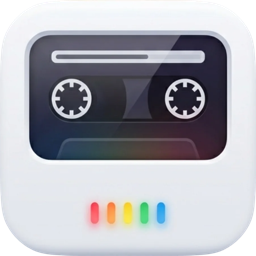

<p align="center">
  
</p>

<h1 align="center">Shelf</h1>

<p align="center">A native macOS audio player for audiobooks, lectures, and long-form listening.<br>
Browse, listen, bookmark, and pick up where you left off.</p>

<p align="center">macOS 14+ · Apple Silicon & Intel</p>
<p align="center"><a href="https://github.com/madebysan/shelf/releases/latest"><strong>Download Shelf</strong></a></p>

<p align="center">
  
</p>

## Features

- **Multiple libraries** — add as many folders as you want, each with independent content and playback state. Switch between them from the sidebar dropdown or manage them all from a single sheet.
- **Library management** — point Shelf at any folder and it scans for m4b, m4a, and mp3 files, extracting metadata and cover art automatically
- **Multiple view modes** — browse your library as a grid, large grid, or sortable list
- **Playback** — play/pause, skip forward/back 30s, adjustable speed (0.5x-2x), chapter navigation, and media key support
- **Bookmarks** — mark important moments with a name and optional note, jump back to them anytime
- **Smart Collections** — auto-grouped sidebar views: Recently Added, Short Books, Long Books, Not Started, Nearly Finished
- **Progress tracking** — playback position is saved automatically and persists across launches
- **Import/Export** — backup and restore your progress and bookmarks as a JSON file
- **Mini Player** — floating always-on-top player that follows across desktop spaces
- **Sidebar navigation** — browse by author, genre, year, smart collection, or status

## Install

Download `Shelf.dmg` from the [latest release](https://github.com/madebysan/shelf/releases/latest), open it, and drag Shelf to your Applications folder.

## Free audio to get started

[Open Culture](https://www.openculture.com/freeaudiobooks) maintains a curated list of 1,000+ free audiobooks — classics from Twain, Orwell, Austen, and more. Download the MP3s, point Shelf at the folder, and you're listening.

## Build from source

Requires Xcode 15+ and macOS 14 (Sonoma) or later.

```bash
git clone https://github.com/madebysan/shelf.git
cd shelf
open Shelf.xcodeproj
```

Build and run with Cmd+R in Xcode.

## Keyboard shortcuts

| Shortcut | Action |
|----------|--------|
| Space | Play / Pause |
| Cmd + Right | Skip forward 30s |
| Cmd + Left | Skip back 30s |
| Cmd + B | Add bookmark |
| Cmd + Shift + M | Toggle mini player |
| Cmd + R | Refresh library |
| Cmd + Shift + O | Add library |
| Cmd + Shift + E | Export progress |
| Cmd + Shift + I | Import progress |

## Architecture

```
Shelf/
  ShelfApp.swift            # App entry point, menu commands
  ContentView.swift         # Main window layout
  Models/
    AudiobookModel          # Core Data model (Book, Bookmark, Library entities)
    Book+Extensions.swift   # Display helpers, formatting
    Bookmark+Extensions.swift
    Library+Extensions.swift # Library display helpers
  ViewModels/
    LibraryViewModel.swift  # Library state, scanning, filtering, import/export
    PlayerViewModel.swift   # Playback bridge, chapters, bookmarks
  Views/
    LibraryGridView.swift   # Grid/list library display
    BookCardView.swift      # Grid card component
    BookListRow.swift       # List row component
    PlayerView.swift        # Full player sheet
    NowPlayingBar.swift     # Bottom bar mini player
    MiniPlayerView.swift    # Floating panel player
    SidebarView.swift       # Navigation sidebar with library switcher
    ChapterListView.swift   # Chapter navigator
    BookmarkListView.swift  # Bookmark list with jump-to
    AddBookmarkSheet.swift  # New bookmark modal
    ManageLibrariesView.swift # Library management sheet
    PreferencesView.swift   # Settings window
  Services/
    AudioPlayerService.swift    # AVPlayer wrapper, Now Playing integration
    PersistenceController.swift # Core Data stack
    LibraryScanner.swift        # File discovery and metadata sync
    MetadataExtractor.swift     # AVFoundation metadata extraction
    ProgressExporter.swift      # JSON import/export
    MiniPlayerController.swift  # Floating NSPanel management
```

## License

MIT
